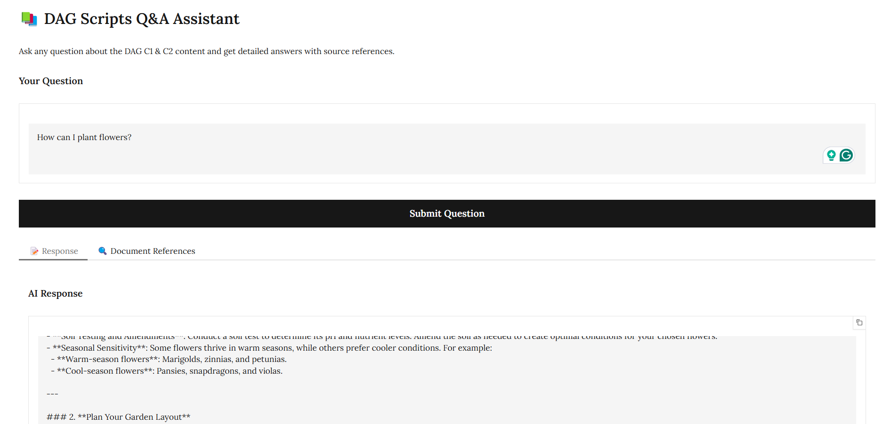
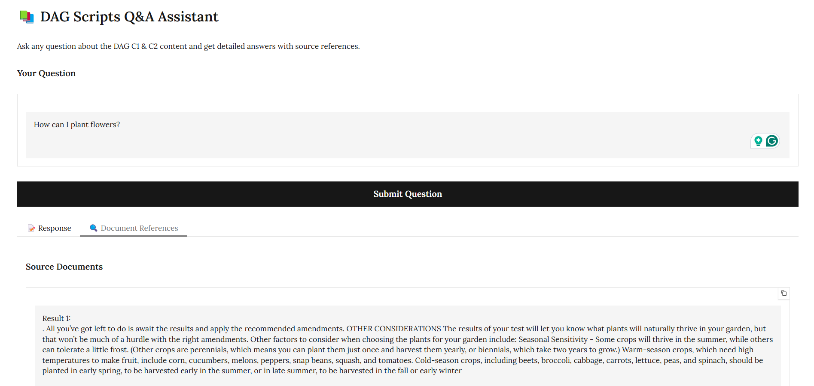

# Retrieval-Augmented Generation System for Interactive Question-Answering on Gardening Manual🤖

## Overview

Implements a **Retrieval-Augmented Generation (RAG)** system for interactive question-answering based on PDF documents. Using **LangChain**, **ChromaDB**, **Gradio**, and **OpenAI** models, the system processes PDFs, extracts relevant information, and generates accurate answers to user queries. Although it uses a gardening manual from [High Rocks](https://highrocks.org/) as an example, the system is flexible and can be adapted to any set of PDF documents. It automatically detects and processes all PDF files in the specified directory.

##  Prerequisites and Setup Instructions 🚀

### **1. Install Python** 🐍

Ensure Python 3.11 or later is installed. If Python is not already installed, follow these steps:

- For a detailed guide on how to install Python on different operating systems, refer to the [Quick Guide for Installing Python](https://github.com/PackeTsar/Install-Python/blob/master/README.md#install-python-).
- The latest version of Python can be downloaded from the official website: [Download Python](https://www.python.org/downloads/).

Verify the installation:

```bash
python --version
```

### **2. Create a Virtual Environment** 💻

Creating a virtual environment is recommended to manage dependencies for the project.

- **For Windows**:
    ```bash
    python -m venv venv
    ```

- **For MacOS/Linux**:
    ```bash
    python3 -m venv venv
    ```

### **3. Activate the Virtual Environment** 🔑

After creating the virtual environment, it needs to be activated:

- **For Windows**:
    ```bash
    venv\Scripts\activate
    ```

- **For MacOS/Linux**:
    ```bash
    source venv/bin/activate
    ```

After activation, the terminal prompt should display `(venv)` at the beginning.

### **4. Install Project Dependencies** 📦

Install the required libraries listed in the `requirements.txt` file:

```bash
pip install -r requirements.txt
```

For MacOS/Linux, use `pip3` if necessary:

```bash
pip3 install -r requirements.txt
```

### **5. Obtain an OpenAI API Key** 🔑

An API key from OpenAI is required to access GPT models. Follow these steps:

1. Go to the [OpenAI API Keys](https://platform.openai.com/account/api-keys) page.
2. Log in or create an account.
3. Generate and copy the API key.

### **6. Configure the API Key** 🔧

Set up the API key for the project by creating a `.env` file in the root directory and adding the following line:

```
OPENAI_API_KEY=your_api_key_here
```

Alternatively, the API key can be exported in the terminal session:

- **For Windows**:
    ```bash
    set OPENAI_API_KEY=your_api_key_here
    ```

- **For MacOS/Linux**:
    ```bash
    export OPENAI_API_KEY='your_api_key_here'
    ```

##  Start the Application ▶️

Run the chatbot application using Streamlit:

```bash
python app.py
```

The application will launch in the default web browser and can be accessed at `http://localhost:8501`.





## Contributing 💡

If you would like to contribute to this project, feel free to fork the repository, create a branch, and submit a pull request. Contributions, suggestions, and improvements are always welcome!

## License 📜

This project is open-source and licensed under the MIT License. See the [LICENSE](LICENSE) file for more details.